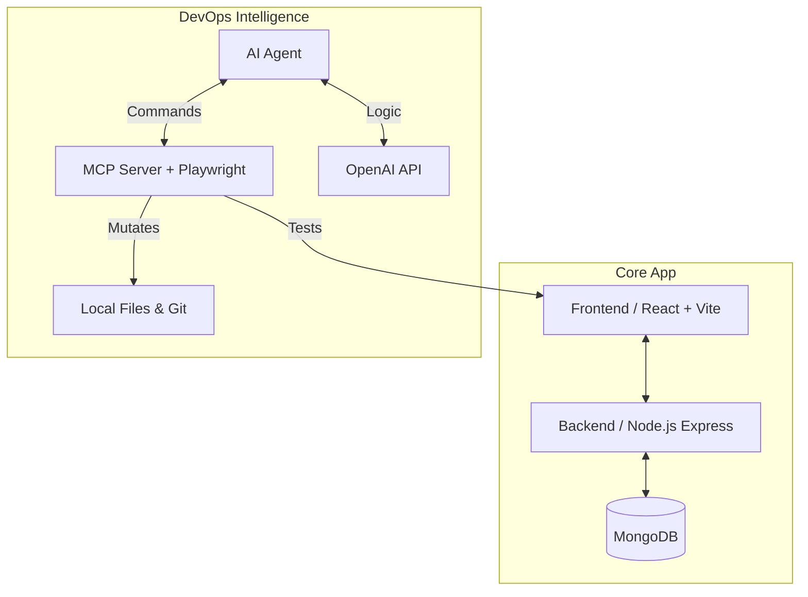
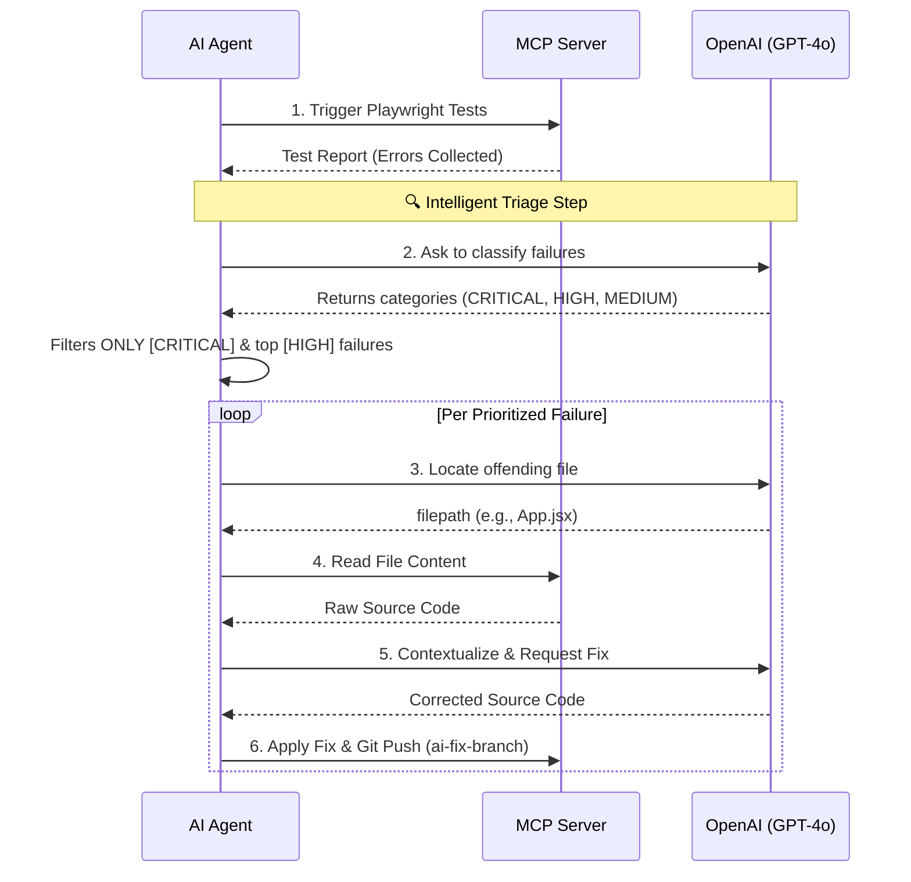

# 🚀 AI-Driven DevOps Monorepo

Welcome to the **AI-Driven DevOps Monorepo**, a modern web application demonstrating the capabilities of an autonomous self-healing software pipeline. This system doesn't just run your code—it actively tests, triages, and writes AI-assisted fixes to itself using a Model Context Protocol (MCP) server.

---

## 🧠 The Logic: How it Works

The ecosystem is built using two distinct halves that work collaboratively:

### 1. Architectural Layout

The platform relies on a traditional **MERN** application core coupled intimately with an external **AI testing framework**. 



- **Frontend & Backend**: Built cleanly using React and Node.js serving standard CRUD APIs.
- **MCP Server**: Acts as the "hands" of the operation. It houses Playwright drivers to simulate E2E user clicks and operates secure Git/Filesystem endpoints.
- **AI Agent**: Acts as the "brain". It watches the MCP server and dictates commands using LLM reasoning.

### 2. Autonomous Healing Pipeline

When you execute the AI Agent, an intelligent loop evaluates the state of your application and automatically repairs broken code.



---

## 💻 Running the App

You have two powerful options to spin up the infrastructure depending on your needs.

### Option A: Local Execution (Rapid Iteration / Demo)
For immediate local development directly tapping into your host's network natively (without Docker constraints). 

We utilize a robust custom orchestration script (`start-all.js`) to spin up the components in parallel while gracefully separating their logs.

1. **Bootstrap dependencies**:
   ```bash
   npm run setup
   ```
   *(This triggers `npm install` across all workspaces and downloads the local Playwright browsers).*

2. **Start the network**:
   ```bash
   npm start
   ```
   *Automatically launches the Backend, the MCP Server, and the Vite Frontend. It will intelligently wait for the React cluster to build before securely popping open your local browser to `http://localhost:5173`.*

3. **Run the Autonomous Agent**:
   In a separate terminal, trigger the AI DevOps cycle:
   ```bash
   npm run start -w ai-agent
   ```
   Watch the terminal as the agent grades, prioritizes, and fixes any logic regressions!

### Option B: Containerized Deployment (Production / Cloud)
When preparing for cloud deployment, utilize standard containerization mapping defined in `docker-compose.yml`.

1. **Build and Launch**:
   ```bash
   docker-compose up --build
   ```
   *(This fully isolates the Mongoose connections, internal networks, and isolates the Playwright OS dependencies).*

---

## 🏗 Directory Structure

| Directory | Purpose |
| ------ | ------ |
| `apps/frontend` | The React SPA executing standard Vite logic |
| `apps/backend` | The Node.js Express server routing MongoDB records |
| `apps/mcp-server` | Express Server executing `playwright` suites and file patching |
| `apps/agent` | The pure LLM-driven Node worker script housing `triage.js` and workflows |
| `start-all.js` | Universal Node parallel child-process orchestrator |
